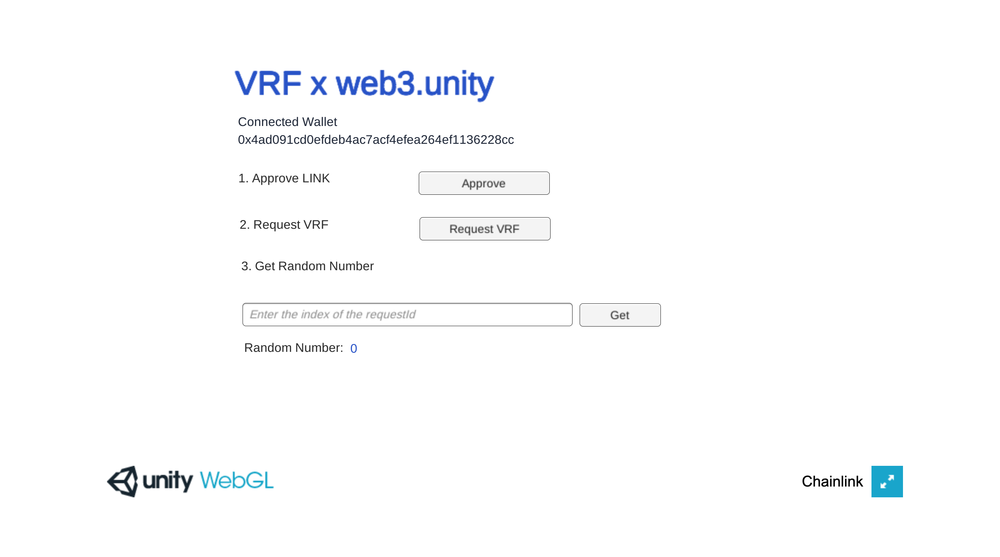

Tech stack in plan to use:
Chainlink VRF with Unity
Unity Game Engine
Gravity Sketch in Meta Quest 3

Short and sweet description:
'Experience Love,' a metaverse space using Unity and Chainlink VRF for XR where customizable experiences await. Social data fuels immersive customized exploration, while VRF powers asset transactions. It accompanies people to explore their worth, which AI can't replace yet.

About the project:

Experience Love is a metaverse space integrating Unity with Chainlink's VRF Asset, being a practical and engaging 3D motion experience for users to customize quests and feel loveable. Users navigate love-themed challenges using Chainlink's secure randomness, ensuring unique experiences. Upon entry, user data from social platforms is connected with consent to generate special and custom collaborative puzzle-solving and emotional scenarios for exploration and love. This step is aided by another AI integration and may be altered at an early stage. The Unity Chainlink VRF Asset not only adds authenticity but also introduces revenue streams, enabling tokenized events and in-app transactions of the metaverse assets. This practical integration positions Experience Love as a human-focused and revenue-generating immersive space, emphasizing harmony between beings, nature, and technologies.
_________________________________________________________________________________________________________

# Tech Stack 1: Unity Chainlink VRF Asset

This Unity asset utilizes the ChainSafe web3 Unity plugin to request Chainlink VRF (Verifiable Random Function) data in your Unity WebGL project. By default, this asset uses the Direct Funding VRF Consumer contract on the Polygon Mumbai network with the address `0xbD7736931920BCC87Dd296c78224ea740E7e6f62`. You can change and configure the contract address and network after importing the assets. This README will guide you through the necessary steps to set up and use this asset in your Unity project, using Unity version 2021.3.8f1.

## Prerequisites

- Unity 2021.3.8f1
- Approve LINK tokens for the VRF contract on the desired network
- MetaMask browser extension

## Supported Networks

- Polygon Mumbai: [0x9472fBaE5c692DD391725B529932f8939f8a5Ad1](https://mumbai.polygonscan.com/address/0x9472fBaE5c692DD391725B529932f8939f8a5Ad1)
- Ethereum Goerli : [0xFB34a709B04314651aB63bb96007E5B1e4f692c5](https://goerli.etherscan.io/address/0xFB34a709B04314651aB63bb96007E5B1e4f692c5)
- Ethereum Sepolia : [0x67965649a77AED694F38019a3e8321c496130424](https://sepolia.etherscan.io/address/0x67965649a77AED694F38019a3e8321c496130424)
- BSC Testnet : [0xC50f1ce56c664262c2F15590c1Ff73D8756200f3](https://testnet.bscscan.com/address/0xC50f1ce56c664262c2F15590c1Ff73D8756200f3)

## Setup

Follow these steps to set up the Unity project with Chainlink VRF asset:

### Step 1: Import the ChainSafe Web3 Unity Plugin

1. Download the latest release of the `web3.unitypackage` asset by ChainSafe from the [official GitHub repository](https://github.com/ChainSafe/web3.unity/releases).
2. Launch Unity and create a new project or open an existing project using Unity version 2021.3.8f1.
3. Import the downloaded `web3.unitypackage` asset by dragging it into the Unity Editor window. You can also import the asset from the `assets` directory of this repository.

### Step 2: Import the VRF Unity Asset

1. Drag and import the `vrf-chainsafe.unitypackage` asset from the `assets` directory of this repository.
2. Navigate to the downloaded `vrf-chainsafe.unitypacakge` asset file and click `Open`. This will load the `vrf-chainsafe.unitypackage` asset in the Unity Editor.
3. You will be prompred to relaod the sample scene. Click `Reload` to reload the scene.

### Step 3: Add WebLogin Scene

1. In the Unity Editor, navigate to `Assets > Web3Unity > Scenes`.
2. Drag the `WebLogin` asset to the Hierarchy window.

### Step 4: Configure Build Settings

1. In the Unity Editor, go to `File > Build Settings`.
2. Switch the platform to `WebGL` by selecting it and clicking `Switch Platform`.
3. Click on `Player Settings` and navigate to `Player > Resolution and Presentation`.
4. Check the `Web3GL-2020x` option under `WebGL Template`.
5. Close the Player Settings window and, in the Build Settings window, click `Add Open Scenes` to add the current scene to the build.
6. Make sure that the `WebLogin` scene is at the top of the list of scenes in the Build Settings window.
7. Click `Build and Run` to build the project and open it in a browser.

